# TinyDB — Complete High-Level & Low-Level Class Design

## 1. End-to-End Architecture

```text
SQL String
  ↓
Lexer
  ↓
Tokens
  ↓
Parser
  ↓
AST / SQL Statement
  ↓
Analyzer / Binder
  ↓
Logical Plan
  ↓
Optimizer
  ↓
Physical Plan
  ↓
Query Engine
  ↓
Executor Tree
  ↓
Transaction Manager
  ↓
Storage Engine
  ↓
Table Heap / Index
  ↓
Buffer Pool
  ↓
Page
  ↓
PageIO / FileChannel
  ↓
.tbl / .idx
  ↓
Disk

Transaction
  └── WAL Manager → wal-*.log
                         ↓
                    Recovery Manager
```

---

# 2. Module-Level High-Level Design

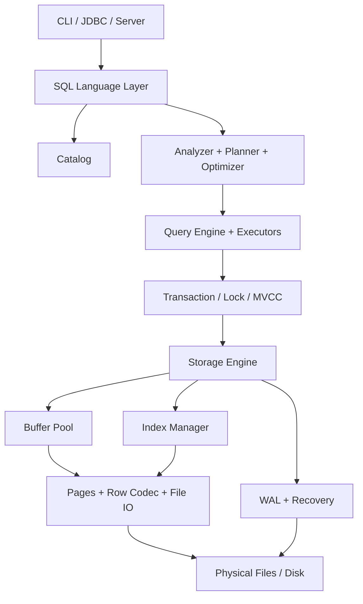
```mermaid
flowchart TB
    Client["CLI / JDBC / Server"]
    SQL["SQL Language Layer"]
    Catalog["Catalog"]
    Planner["Analyzer + Planner + Optimizer"]
    Execution["Query Engine + Executors"]
    Tx["Transaction / Lock / MVCC"]
    Storage["Storage Engine"]
    Buffer["Buffer Pool"]
    Physical["Pages + Row Codec + File IO"]
    WAL["WAL + Recovery"]
    Index["Index Manager"]
    Disk["Physical Files / Disk"]

    Client --> SQL
    SQL --> Catalog
    SQL --> Planner
    Planner --> Execution
    Execution --> Tx
    Tx --> Storage
    Storage --> Buffer
    Storage --> Index
    Storage --> WAL
    Buffer --> Physical
    Index --> Physical
    Physical --> Disk
    WAL --> Disk
```

---

# 3. Java Module Structure

```text
tinydb/
├── tinydb-common
├── tinydb-sql
├── tinydb-catalog
├── tinydb-planner
├── tinydb-execution
├── tinydb-transaction
├── tinydb-storage
├── tinydb-index
├── tinydb-recovery
├── tinydb-server
├── tinydb-client
├── tinydb-jdbc
├── tinydb-cli
├── tinydb-stream
├── tinydb-replication
├── tinydb-minispring
└── tinydb-tests
```

Recommended package tree:

```text
com.tinydb
├── common
├── sql
│   ├── lexer
│   ├── token
│   ├── parser
│   ├── ast
│   ├── statement
│   └── expression
├── catalog
├── planner
│   ├── analyzer
│   ├── logical
│   ├── physical
│   ├── optimizer
│   └── cost
├── execution
│   ├── engine
│   ├── executor
│   ├── operator
│   ├── tuple
│   └── context
├── transaction
├── storage
│   ├── engine
│   ├── buffer
│   ├── page
│   ├── heap
│   ├── record
│   ├── file
│   └── free
├── index
├── recovery
│   ├── wal
│   ├── checkpoint
│   └── recovery
├── jdbc
├── cli
└── minispring
```

---

# 4. SQL Lexer

The lexer converts characters into tokens.

Example:

```sql
SELECT name FROM employees WHERE age > 30;
```

becomes:

```text
SELECT
IDENTIFIER(name)
FROM
IDENTIFIER(employees)
WHERE
IDENTIFIER(age)
GREATER_THAN
INTEGER(30)
SEMICOLON
EOF
```

## Lexer Class Diagram

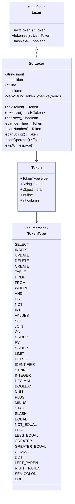
```mermaid
classDiagram
    class Lexer {
        <<interface>>
        +nextToken() Token
        +tokenize() List~Token~
        +hasNext() boolean
    }

    class SqlLexer {
        -String input
        -int position
        -int line
        -int column
        -Map~String,TokenType~ keywords
        +nextToken() Token
        +tokenize() List~Token~
        +hasNext() boolean
        -scanIdentifier() Token
        -scanNumber() Token
        -scanString() Token
        -scanOperator() Token
        -skipWhitespace()
    }

    class Token {
        +TokenType type
        +String lexeme
        +Object literal
        +int line
        +int column
    }

    class TokenType {
        <<enumeration>>
        SELECT
        INSERT
        UPDATE
        DELETE
        CREATE
        TABLE
        DROP
        FROM
        WHERE
        AND
        OR
        NOT
        INTO
        VALUES
        SET
        JOIN
        ON
        GROUP
        BY
        ORDER
        LIMIT
        OFFSET
        IDENTIFIER
        STRING
        INTEGER
        DECIMAL
        BOOLEAN
        NULL
        PLUS
        MINUS
        STAR
        SLASH
        EQUAL
        NOT_EQUAL
        LESS
        LESS_EQUAL
        GREATER
        GREATER_EQUAL
        COMMA
        DOT
        LEFT_PAREN
        RIGHT_PAREN
        SEMICOLON
        EOF
    }

    Lexer <|.. SqlLexer
    SqlLexer --> Token
    Token --> TokenType
```

Implementation:

```java
public interface Lexer {
    Token nextToken();
    List<Token> tokenize();
    boolean hasNext();
}

public final class SqlLexer implements Lexer {
    private final String input;
    private int position;

    @Override
    public List<Token> tokenize() {
        List<Token> result = new ArrayList<>();
        while (hasNext()) {
            result.add(nextToken());
        }
        return result;
    }
}
```

---

# 5. Parser

The parser consumes tokens and produces an AST.

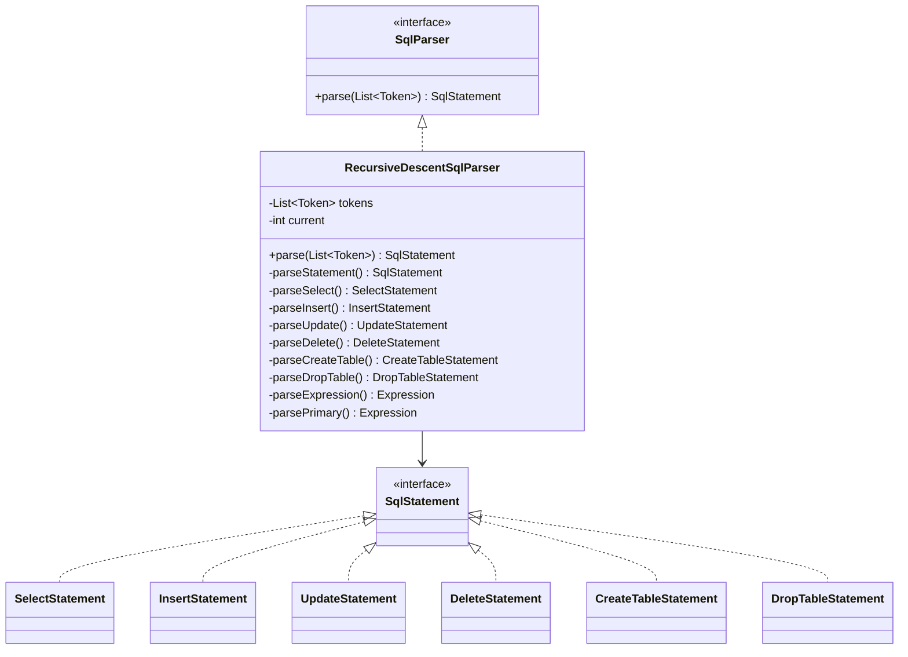
```mermaid
classDiagram
    class SqlParser {
        <<interface>>
        +parse(List~Token~) SqlStatement
    }

    class RecursiveDescentSqlParser {
        -List~Token~ tokens
        -int current
        +parse(List~Token~) SqlStatement
        -parseStatement() SqlStatement
        -parseSelect() SelectStatement
        -parseInsert() InsertStatement
        -parseUpdate() UpdateStatement
        -parseDelete() DeleteStatement
        -parseCreateTable() CreateTableStatement
        -parseDropTable() DropTableStatement
        -parseExpression() Expression
        -parsePrimary() Expression
    }

    class SqlStatement {
        <<interface>>
    }

    class SelectStatement
    class InsertStatement
    class UpdateStatement
    class DeleteStatement
    class CreateTableStatement
    class DropTableStatement

    SqlParser <|.. RecursiveDescentSqlParser
    RecursiveDescentSqlParser --> SqlStatement

    SqlStatement <|.. SelectStatement
    SqlStatement <|.. InsertStatement
    SqlStatement <|.. UpdateStatement
    SqlStatement <|.. DeleteStatement
    SqlStatement <|.. CreateTableStatement
    SqlStatement <|.. DropTableStatement
```

---

# 6. SQL Statement Hierarchy

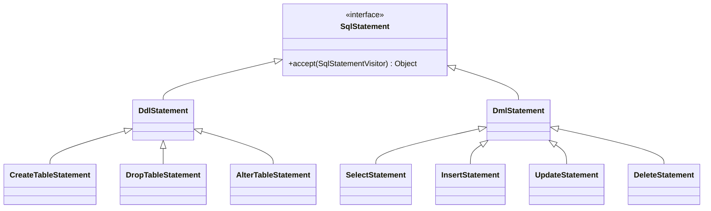
```mermaid
classDiagram
    class SqlStatement {
        <<interface>>
        +accept(SqlStatementVisitor) Object
    }

    class DdlStatement
    class DmlStatement

    class SelectStatement
    class InsertStatement
    class UpdateStatement
    class DeleteStatement
    class CreateTableStatement
    class DropTableStatement
    class AlterTableStatement

    SqlStatement <|-- DdlStatement
    SqlStatement <|-- DmlStatement

    DmlStatement <|-- SelectStatement
    DmlStatement <|-- InsertStatement
    DmlStatement <|-- UpdateStatement
    DmlStatement <|-- DeleteStatement

    DdlStatement <|-- CreateTableStatement
    DdlStatement <|-- DropTableStatement
    DdlStatement <|-- AlterTableStatement
```

Recommended visitor:

```java
public interface SqlStatementVisitor<R> {
    R visitSelect(SelectStatement statement);
    R visitInsert(InsertStatement statement);
    R visitUpdate(UpdateStatement statement);
    R visitDelete(DeleteStatement statement);
    R visitCreateTable(CreateTableStatement statement);
    R visitDropTable(DropTableStatement statement);
}
```

---

# 7. Expression Tree

For:

```sql
WHERE age > 30 AND salary >= 50000
```

AST:

```text
             AND
            /              >     >=
          / \   /         age 30 salary 50000
```

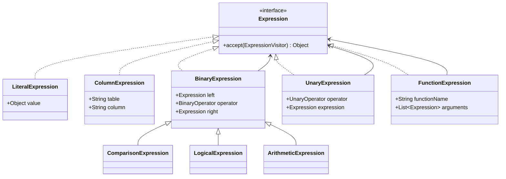
```mermaid
classDiagram
    class Expression {
        <<interface>>
        +accept(ExpressionVisitor) Object
    }

    class LiteralExpression {
        +Object value
    }

    class ColumnExpression {
        +String table
        +String column
    }

    class BinaryExpression {
        +Expression left
        +BinaryOperator operator
        +Expression right
    }

    class UnaryExpression {
        +UnaryOperator operator
        +Expression expression
    }

    class FunctionExpression {
        +String functionName
        +List~Expression~ arguments
    }

    class ComparisonExpression
    class LogicalExpression
    class ArithmeticExpression

    Expression <|.. LiteralExpression
    Expression <|.. ColumnExpression
    Expression <|.. BinaryExpression
    Expression <|.. UnaryExpression
    Expression <|.. FunctionExpression

    BinaryExpression <|-- ComparisonExpression
    BinaryExpression <|-- LogicalExpression
    BinaryExpression <|-- ArithmeticExpression

    BinaryExpression --> Expression
    UnaryExpression --> Expression
    FunctionExpression --> Expression
```

---

# 8. Catalog

The catalog answers:

```text
Does table employees exist?
What columns does employees have?
What are their types?
Which indexes exist?
Which constraints exist?
```

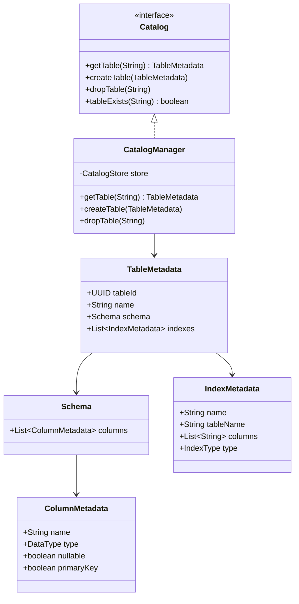
```mermaid
classDiagram
    class Catalog {
        <<interface>>
        +getTable(String) TableMetadata
        +createTable(TableMetadata)
        +dropTable(String)
        +tableExists(String) boolean
    }

    class CatalogManager {
        -CatalogStore store
        +getTable(String) TableMetadata
        +createTable(TableMetadata)
        +dropTable(String)
    }

    class TableMetadata {
        +UUID tableId
        +String name
        +Schema schema
        +List~IndexMetadata~ indexes
    }

    class Schema {
        +List~ColumnMetadata~ columns
    }

    class ColumnMetadata {
        +String name
        +DataType type
        +boolean nullable
        +boolean primaryKey
    }

    class IndexMetadata {
        +String name
        +String tableName
        +List~String~ columns
        +IndexType type
    }

    Catalog <|.. CatalogManager
    CatalogManager --> TableMetadata
    TableMetadata --> Schema
    TableMetadata --> IndexMetadata
    Schema --> ColumnMetadata
```

---

# 9. Analyzer / Binder

The parser checks syntax. The analyzer checks meaning.

Example:

```sql
SELECT unknown_column FROM employees;
```

Parser: valid syntax.

Analyzer: invalid because the column does not exist.

Responsibilities:

- resolve tables
- resolve columns
- check data types
- expand `*`
- validate functions
- resolve aliases
- validate expressions

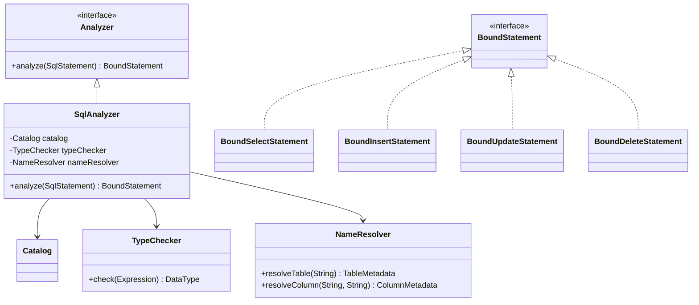
```mermaid
classDiagram
    class Analyzer {
        <<interface>>
        +analyze(SqlStatement) BoundStatement
    }

    class SqlAnalyzer {
        -Catalog catalog
        -TypeChecker typeChecker
        -NameResolver nameResolver
        +analyze(SqlStatement) BoundStatement
    }

    class NameResolver {
        +resolveTable(String) TableMetadata
        +resolveColumn(String, String) ColumnMetadata
    }

    class TypeChecker {
        +check(Expression) DataType
    }

    class BoundStatement {
        <<interface>>
    }

    class BoundSelectStatement
    class BoundInsertStatement
    class BoundUpdateStatement
    class BoundDeleteStatement

    Analyzer <|.. SqlAnalyzer
    SqlAnalyzer --> Catalog
    SqlAnalyzer --> TypeChecker
    SqlAnalyzer --> NameResolver

    BoundStatement <|.. BoundSelectStatement
    BoundStatement <|.. BoundInsertStatement
    BoundStatement <|.. BoundUpdateStatement
    BoundStatement <|.. BoundDeleteStatement
```

---

# 10. Query Planner

```text
BoundStatement
      ↓
Logical Plan
      ↓
Optimizer
      ↓
Physical Plan
```

Example:

```sql
SELECT name
FROM employees
WHERE age > 30;
```

Logical:

```text
Project(name)
    |
Filter(age > 30)
    |
Scan(employees)
```

Physical if an index exists:

```text
Project(name)
    |
IndexScan(age > 30)
```

## Logical Plan

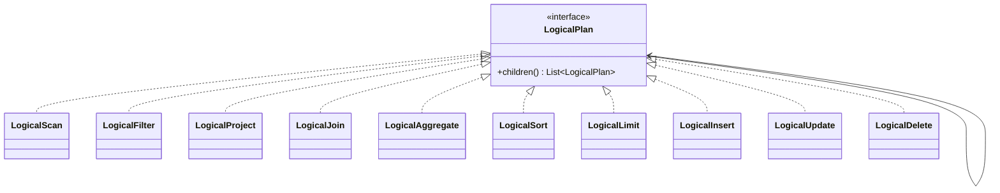
```mermaid
classDiagram
    class LogicalPlan {
        <<interface>>
        +children() List~LogicalPlan~
    }

    class LogicalScan
    class LogicalFilter
    class LogicalProject
    class LogicalJoin
    class LogicalAggregate
    class LogicalSort
    class LogicalLimit
    class LogicalInsert
    class LogicalUpdate
    class LogicalDelete

    LogicalPlan <|.. LogicalScan
    LogicalPlan <|.. LogicalFilter
    LogicalPlan <|.. LogicalProject
    LogicalPlan <|.. LogicalJoin
    LogicalPlan <|.. LogicalAggregate
    LogicalPlan <|.. LogicalSort
    LogicalPlan <|.. LogicalLimit
    LogicalPlan <|.. LogicalInsert
    LogicalPlan <|.. LogicalUpdate
    LogicalPlan <|.. LogicalDelete

    LogicalPlan --> LogicalPlan
```

## Physical Plan

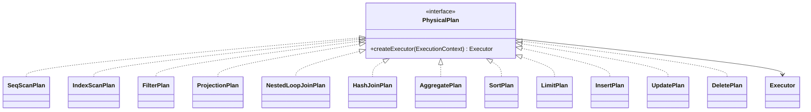
```mermaid
classDiagram
    class PhysicalPlan {
        <<interface>>
        +createExecutor(ExecutionContext) Executor
    }

    class SeqScanPlan
    class IndexScanPlan
    class FilterPlan
    class ProjectionPlan
    class NestedLoopJoinPlan
    class HashJoinPlan
    class AggregatePlan
    class SortPlan
    class LimitPlan
    class InsertPlan
    class UpdatePlan
    class DeletePlan

    PhysicalPlan <|.. SeqScanPlan
    PhysicalPlan <|.. IndexScanPlan
    PhysicalPlan <|.. FilterPlan
    PhysicalPlan <|.. ProjectionPlan
    PhysicalPlan <|.. NestedLoopJoinPlan
    PhysicalPlan <|.. HashJoinPlan
    PhysicalPlan <|.. AggregatePlan
    PhysicalPlan <|.. SortPlan
    PhysicalPlan <|.. LimitPlan
    PhysicalPlan <|.. InsertPlan
    PhysicalPlan <|.. UpdatePlan
    PhysicalPlan <|.. DeletePlan

    PhysicalPlan --> Executor
```

Planner classes:

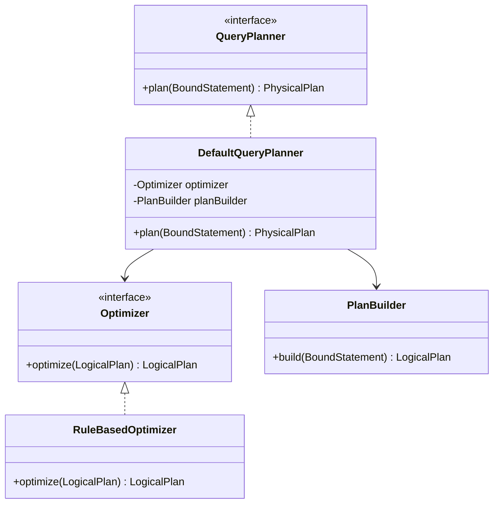
```mermaid
classDiagram
    class QueryPlanner {
        <<interface>>
        +plan(BoundStatement) PhysicalPlan
    }

    class DefaultQueryPlanner {
        -Optimizer optimizer
        -PlanBuilder planBuilder
        +plan(BoundStatement) PhysicalPlan
    }

    class Optimizer {
        <<interface>>
        +optimize(LogicalPlan) LogicalPlan
    }

    class RuleBasedOptimizer {
        +optimize(LogicalPlan) LogicalPlan
    }

    class PlanBuilder {
        +build(BoundStatement) LogicalPlan
    }

    QueryPlanner <|.. DefaultQueryPlanner
    DefaultQueryPlanner --> Optimizer
    DefaultQueryPlanner --> PlanBuilder
    Optimizer <|.. RuleBasedOptimizer
```

---

# 11. Query Engine

The QueryEngine is the main execution facade.

```java
public interface QueryEngine {
    QueryResult execute(
        SqlStatement statement,
        ExecutionContext context
    );
}
```

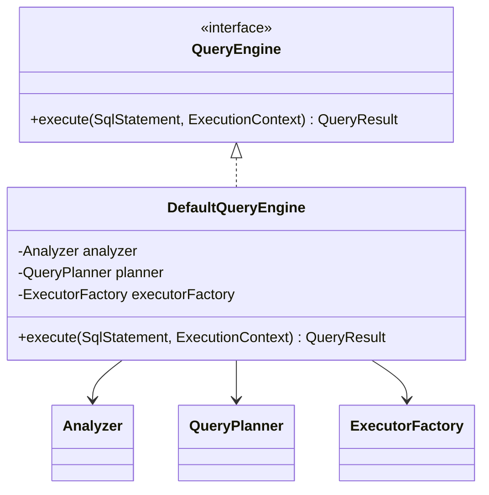
```mermaid
classDiagram
    class QueryEngine {
        <<interface>>
        +execute(SqlStatement, ExecutionContext) QueryResult
    }

    class DefaultQueryEngine {
        -Analyzer analyzer
        -QueryPlanner planner
        -ExecutorFactory executorFactory
        +execute(SqlStatement, ExecutionContext) QueryResult
    }

    QueryEngine <|.. DefaultQueryEngine
    DefaultQueryEngine --> Analyzer
    DefaultQueryEngine --> QueryPlanner
    DefaultQueryEngine --> ExecutorFactory
```

Implementation flow:

```java
BoundStatement bound = analyzer.analyze(statement);
PhysicalPlan plan = planner.plan(bound);
Executor executor = executorFactory.create(plan, context);
return executor.execute();
```

---

# 12. Executor Architecture

Use the iterator / Volcano model:

```java
public interface Executor {
    void open();
    Tuple next();
    void close();
}
```

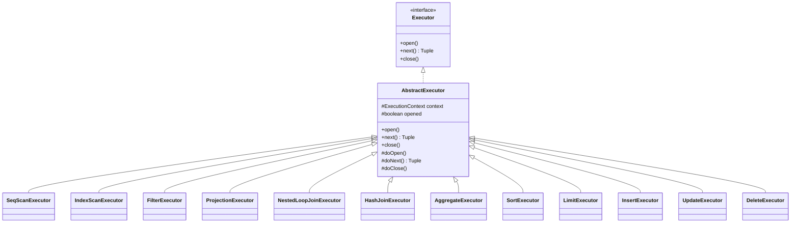
```mermaid
classDiagram
    class Executor {
        <<interface>>
        +open()
        +next() Tuple
        +close()
    }

    class AbstractExecutor {
        #ExecutionContext context
        #boolean opened
        +open()
        +next() Tuple
        +close()
        #doOpen()
        #doNext() Tuple
        #doClose()
    }

    class SeqScanExecutor
    class IndexScanExecutor
    class FilterExecutor
    class ProjectionExecutor
    class NestedLoopJoinExecutor
    class HashJoinExecutor
    class AggregateExecutor
    class SortExecutor
    class LimitExecutor
    class InsertExecutor
    class UpdateExecutor
    class DeleteExecutor

    Executor <|.. AbstractExecutor
    AbstractExecutor <|-- SeqScanExecutor
    AbstractExecutor <|-- IndexScanExecutor
    AbstractExecutor <|-- FilterExecutor
    AbstractExecutor <|-- ProjectionExecutor
    AbstractExecutor <|-- NestedLoopJoinExecutor
    AbstractExecutor <|-- HashJoinExecutor
    AbstractExecutor <|-- AggregateExecutor
    AbstractExecutor <|-- SortExecutor
    AbstractExecutor <|-- LimitExecutor
    AbstractExecutor <|-- InsertExecutor
    AbstractExecutor <|-- UpdateExecutor
    AbstractExecutor <|-- DeleteExecutor
```

---

# 13. Executor Tree

For:

```sql
SELECT name
FROM employees
WHERE age > 30
LIMIT 10;
```

```text
LimitExecutor
      |
ProjectionExecutor
      |
FilterExecutor
      |
SeqScanExecutor
      |
TableHeap
```

This is a Composite + Iterator design.

---

# 14. Scan Executor

```java
public final class SeqScanExecutor
        extends AbstractExecutor {

    private final TableHeap tableHeap;
    private HeapIterator iterator;

    @Override
    protected void doOpen() {
        iterator = tableHeap.scan();
    }

    @Override
    protected Tuple doNext() {
        if (!iterator.hasNext()) {
            return null;
        }
        return iterator.next();
    }
}
```

---

# 15. Filter Executor

```java
public final class FilterExecutor
        extends AbstractExecutor {

    private final Executor child;
    private final ExpressionEvaluator evaluator;

    @Override
    protected Tuple doNext() {
        Tuple tuple;

        while ((tuple = child.next()) != null) {
            if (evaluator.evaluate(tuple)) {
                return tuple;
            }
        }

        return null;
    }
}
```

---

# 16. Projection Executor

```java
public final class ProjectionExecutor
        extends AbstractExecutor {

    private final Executor child;
    private final List<Expression> expressions;

    @Override
    protected Tuple doNext() {
        Tuple input = child.next();

        if (input == null) {
            return null;
        }

        return evaluateProjection(input);
    }
}
```

---

# 17. Mutation Executors

## INSERT

```text
InsertExecutor
  ↓
Transaction
  ↓
StorageEngine.insert()
  ↓
RowCodec
  ↓
FreeSpaceManager
  ↓
BufferPool
  ↓
Page.insert()
  ↓
WAL
```

## UPDATE

```text
UpdateExecutor
  ↓
Scan / IndexScan
  ↓
RowId
  ↓
Transaction.update()
  ↓
Page.update()
  ↓
WAL UPDATE
```

## DELETE

```text
DeleteExecutor
  ↓
Scan / IndexScan
  ↓
RowId
  ↓
Transaction.delete()
  ↓
Page.markDeleted()
  ↓
WAL DELETE
```

---

# 18. Tuple Model

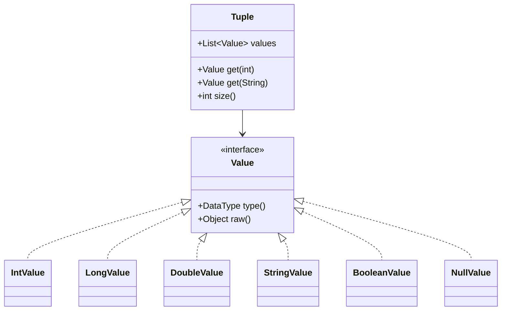
```mermaid
classDiagram
    class Tuple {
        +List~Value~ values
        +Value get(int)
        +Value get(String)
        +int size()
    }

    class Value {
        <<interface>>
        +DataType type()
        +Object raw()
    }

    class IntValue
    class LongValue
    class DoubleValue
    class StringValue
    class BooleanValue
    class NullValue

    Value <|.. IntValue
    Value <|.. LongValue
    Value <|.. DoubleValue
    Value <|.. StringValue
    Value <|.. BooleanValue
    Value <|.. NullValue

    Tuple --> Value
```

---

# 19. Expression Evaluation

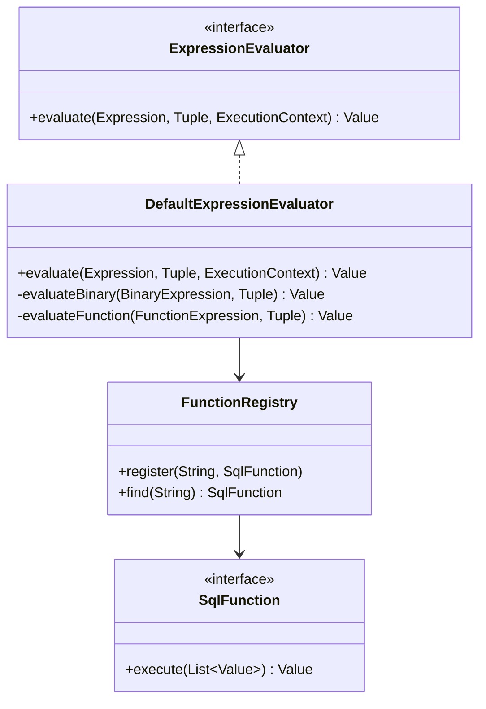
```mermaid
classDiagram
    class ExpressionEvaluator {
        <<interface>>
        +evaluate(Expression, Tuple, ExecutionContext) Value
    }

    class DefaultExpressionEvaluator {
        +evaluate(Expression, Tuple, ExecutionContext) Value
        -evaluateBinary(BinaryExpression, Tuple) Value
        -evaluateFunction(FunctionExpression, Tuple) Value
    }

    class FunctionRegistry {
        +register(String, SqlFunction)
        +find(String) SqlFunction
    }

    class SqlFunction {
        <<interface>>
        +execute(List~Value~) Value
    }

    ExpressionEvaluator <|.. DefaultExpressionEvaluator
    DefaultExpressionEvaluator --> FunctionRegistry
    FunctionRegistry --> SqlFunction
```

---

# 20. Transaction Layer

Executors should never implement commit/rollback themselves.

```text
Executor
   ↓
Transaction
   ↓
StorageEngine
```

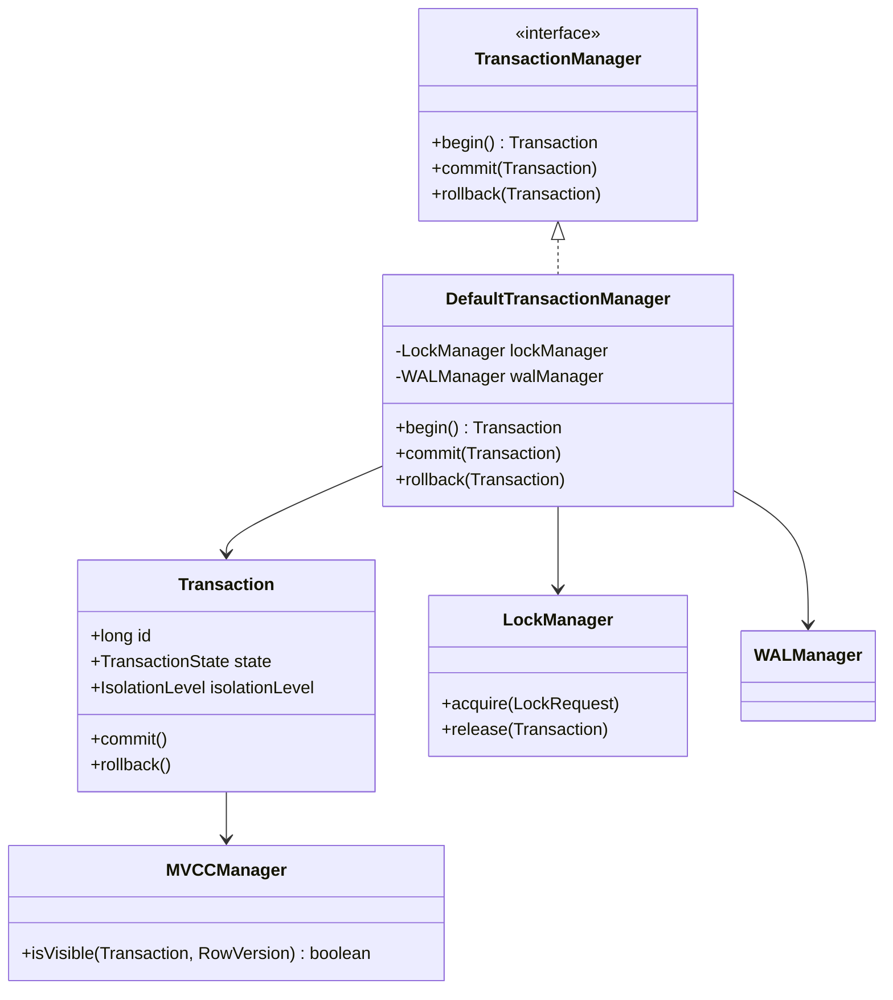
```mermaid
classDiagram
    class TransactionManager {
        <<interface>>
        +begin() Transaction
        +commit(Transaction)
        +rollback(Transaction)
    }

    class DefaultTransactionManager {
        -LockManager lockManager
        -WALManager walManager
        +begin() Transaction
        +commit(Transaction)
        +rollback(Transaction)
    }

    class Transaction {
        +long id
        +TransactionState state
        +IsolationLevel isolationLevel
        +commit()
        +rollback()
    }

    class LockManager {
        +acquire(LockRequest)
        +release(Transaction)
    }

    class MVCCManager {
        +isVisible(Transaction, RowVersion) boolean
    }

    TransactionManager <|.. DefaultTransactionManager
    DefaultTransactionManager --> LockManager
    DefaultTransactionManager --> WALManager
    DefaultTransactionManager --> Transaction
    Transaction --> MVCCManager
```

---

# 21. Storage Engine

Stable interface:

```java
public interface StorageEngine {

    TableStorage openTable(TableMetadata metadata);

    RowId insert(
        Transaction tx,
        TableMetadata table,
        Tuple tuple
    );

    void update(
        Transaction tx,
        TableMetadata table,
        RowId rowId,
        Tuple tuple
    );

    void delete(
        Transaction tx,
        TableMetadata table,
        RowId rowId
    );

    Tuple read(
        Transaction tx,
        TableMetadata table,
        RowId rowId
    );
}
```

Class diagram:

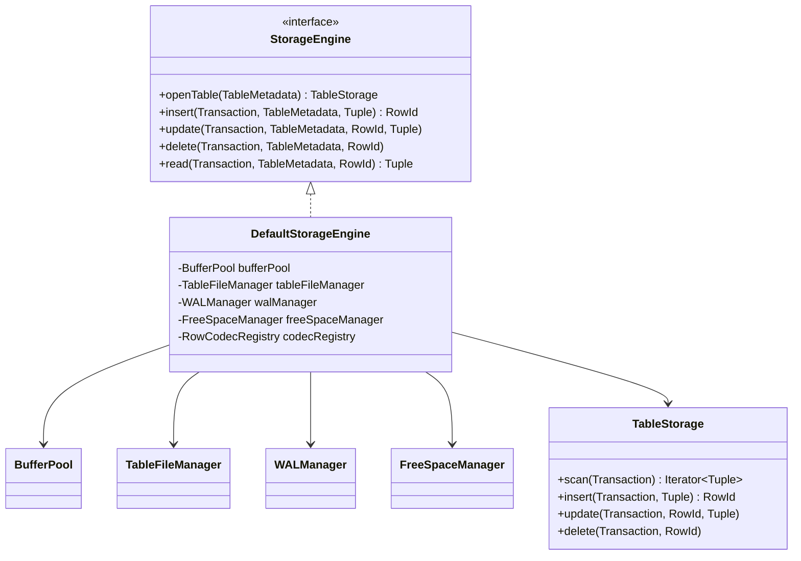
```mermaid
classDiagram
    class StorageEngine {
        <<interface>>
        +openTable(TableMetadata) TableStorage
        +insert(Transaction, TableMetadata, Tuple) RowId
        +update(Transaction, TableMetadata, RowId, Tuple)
        +delete(Transaction, TableMetadata, RowId)
        +read(Transaction, TableMetadata, RowId) Tuple
    }

    class DefaultStorageEngine {
        -BufferPool bufferPool
        -TableFileManager tableFileManager
        -WALManager walManager
        -FreeSpaceManager freeSpaceManager
        -RowCodecRegistry codecRegistry
    }

    class TableStorage {
        +scan(Transaction) Iterator~Tuple~
        +insert(Transaction, Tuple) RowId
        +update(Transaction, RowId, Tuple)
        +delete(Transaction, RowId)
    }

    StorageEngine <|.. DefaultStorageEngine
    DefaultStorageEngine --> BufferPool
    DefaultStorageEngine --> TableFileManager
    DefaultStorageEngine --> WALManager
    DefaultStorageEngine --> FreeSpaceManager
    DefaultStorageEngine --> TableStorage
```

---

# 22. Table Heap

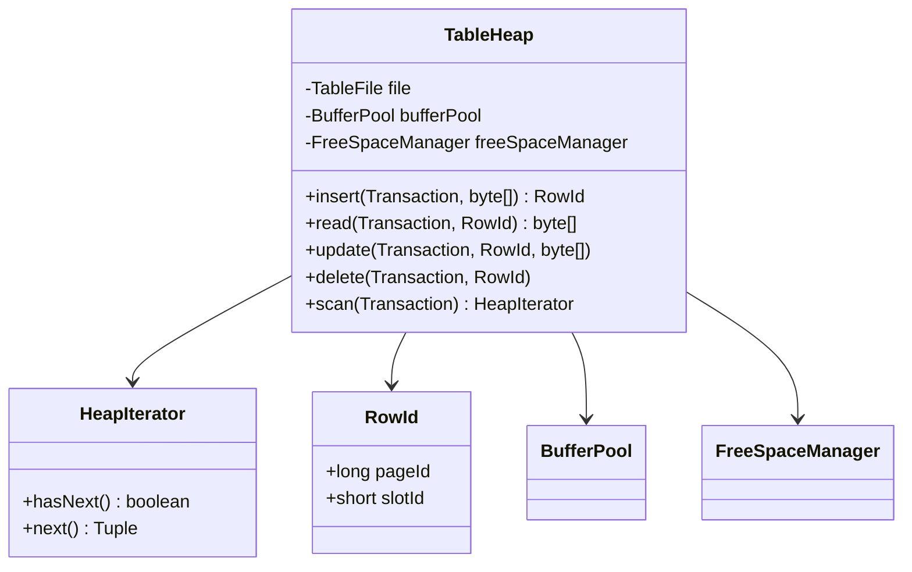
```mermaid
classDiagram
    class TableHeap {
        -TableFile file
        -BufferPool bufferPool
        -FreeSpaceManager freeSpaceManager
        +insert(Transaction, byte[]) RowId
        +read(Transaction, RowId) byte[]
        +update(Transaction, RowId, byte[])
        +delete(Transaction, RowId)
        +scan(Transaction) HeapIterator
    }

    class HeapIterator {
        +hasNext() boolean
        +next() Tuple
    }

    class RowId {
        +long pageId
        +short slotId
    }

    TableHeap --> HeapIterator
    TableHeap --> RowId
    TableHeap --> BufferPool
    TableHeap --> FreeSpaceManager
```

A RowId means:

```text
employees.tbl
    ↓
Page 42
    ↓
Slot 7

RowId(42, 7)
```

---

# 23. Physical Page

Recommended initial page size:

```text
8192 bytes
```

Slotted page:

```text
+----------------------------+
| Page Header                |
+----------------------------+
| Tuple Data                 |
|                            |
|        Free Space          |
|                            |
+----------------------------+
| Slot Directory             |
+----------------------------+
```

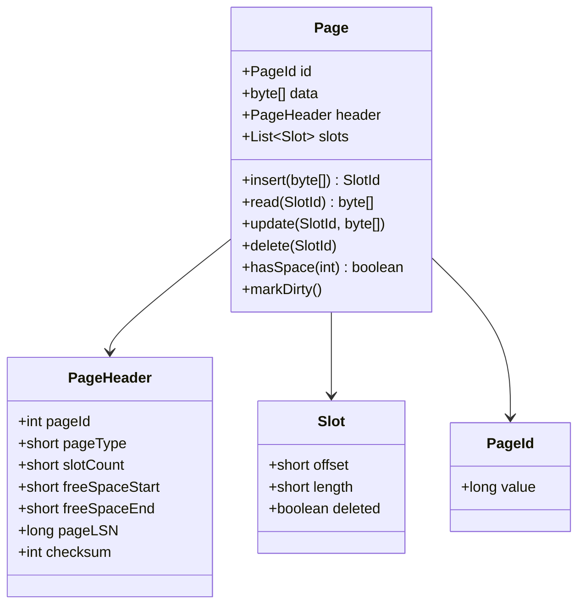
```mermaid
classDiagram
    class Page {
        +PageId id
        +byte[] data
        +PageHeader header
        +List~Slot~ slots
        +insert(byte[]) SlotId
        +read(SlotId) byte[]
        +update(SlotId, byte[])
        +delete(SlotId)
        +hasSpace(int) boolean
        +markDirty()
    }

    class PageHeader {
        +int pageId
        +short pageType
        +short slotCount
        +short freeSpaceStart
        +short freeSpaceEnd
        +long pageLSN
        +int checksum
    }

    class Slot {
        +short offset
        +short length
        +boolean deleted
    }

    class PageId {
        +long value
    }

    Page --> PageHeader
    Page --> Slot
    Page --> PageId
```

---

# 24. Row Codec

Never use Java serialization for database records.

Use explicit binary encoding.

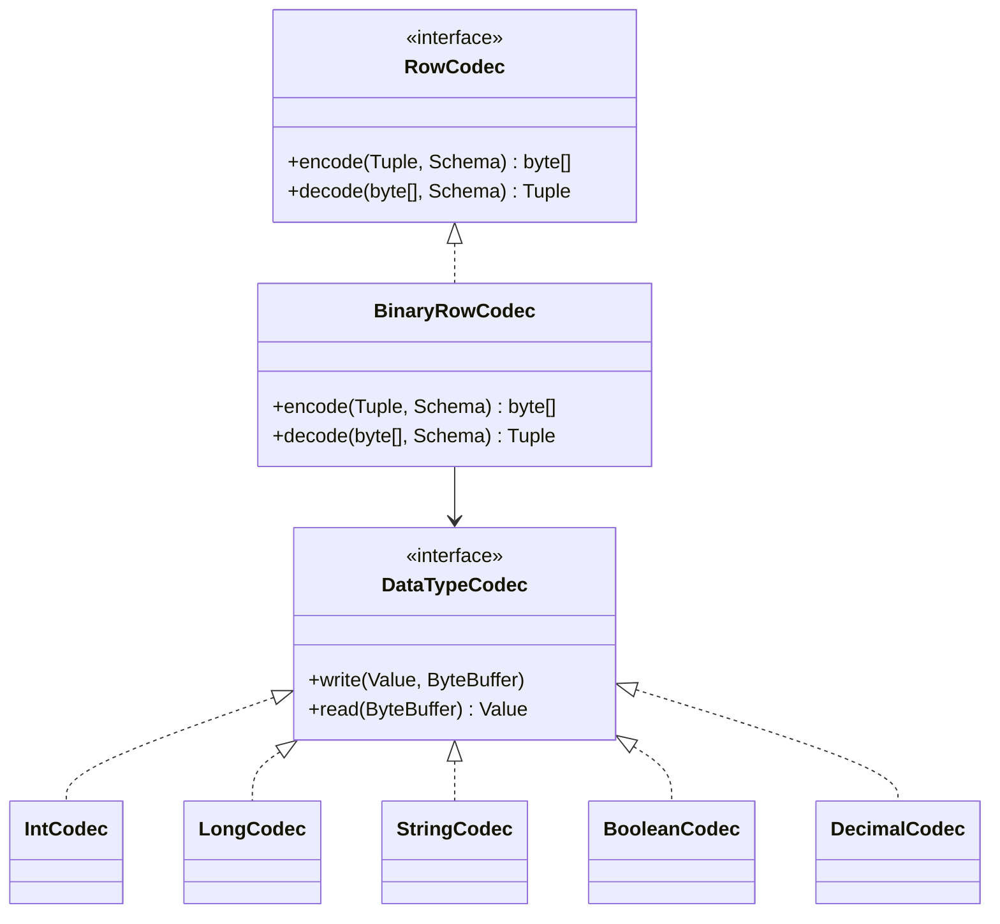
```mermaid
classDiagram
    class RowCodec {
        <<interface>>
        +encode(Tuple, Schema) byte[]
        +decode(byte[], Schema) Tuple
    }

    class BinaryRowCodec {
        +encode(Tuple, Schema) byte[]
        +decode(byte[], Schema) Tuple
    }

    class DataTypeCodec {
        <<interface>>
        +write(Value, ByteBuffer)
        +read(ByteBuffer) Value
    }

    class IntCodec
    class LongCodec
    class StringCodec
    class BooleanCodec
    class DecimalCodec

    RowCodec <|.. BinaryRowCodec
    BinaryRowCodec --> DataTypeCodec

    DataTypeCodec <|.. IntCodec
    DataTypeCodec <|.. LongCodec
    DataTypeCodec <|.. StringCodec
    DataTypeCodec <|.. BooleanCodec
    DataTypeCodec <|.. DecimalCodec
```

Suggested physical record:

```text
Record Header
  ↓
Null Bitmap
  ↓
Column Data
```

---

# 25. Buffer Pool

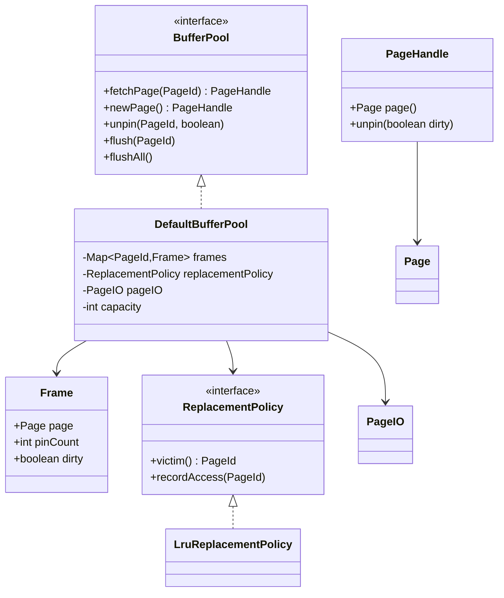
```mermaid
classDiagram
    class BufferPool {
        <<interface>>
        +fetchPage(PageId) PageHandle
        +newPage() PageHandle
        +unpin(PageId, boolean)
        +flush(PageId)
        +flushAll()
    }

    class DefaultBufferPool {
        -Map~PageId,Frame~ frames
        -ReplacementPolicy replacementPolicy
        -PageIO pageIO
        -int capacity
    }

    class Frame {
        +Page page
        +int pinCount
        +boolean dirty
    }

    class PageHandle {
        +Page page()
        +unpin(boolean dirty)
    }

    class ReplacementPolicy {
        <<interface>>
        +victim() PageId
        +recordAccess(PageId)
    }

    class LruReplacementPolicy

    BufferPool <|.. DefaultBufferPool
    DefaultBufferPool --> Frame
    DefaultBufferPool --> PageIO
    DefaultBufferPool --> ReplacementPolicy
    ReplacementPolicy <|.. LruReplacementPolicy
    PageHandle --> Page
```

---

# 26. PageIO and FileChannel

```java
public interface PageIO {
    Page read(PageId pageId);
    void write(Page page);
    void force();
}
```

```mermaid
classDiagram
    class PageIO {
        <<interface>>
        +read(PageId) Page
        +write(Page)
        +force()
    }

    class FileChannelPageIO {
        -FileChannel channel
        +read(PageId) Page
        +write(Page)
        +force()
    }

    PageIO <|.. FileChannelPageIO
    FileChannelPageIO --> FileChannel
```

The physical offset is:

```text
offset = pageId * PAGE_SIZE
```

For an 8192-byte page:

```java
long offset = pageId.value() * 8192L;
channel.position(offset);
channel.read(buffer);
```

---

# 27. Physical File Layer

```mermaid
classDiagram
    class TableFileManager {
        +open(TableMetadata) TableFile
        +create(TableMetadata) TableFile
        +close(TableFile)
    }

    class TableFile {
        +Path path
        +FileChannel channel
        +readPage(PageId) Page
        +writePage(Page)
        +force()
    }

    class FileChannelFactory {
        +open(Path) FileChannel
    }

    class DatabaseDirectory {
        +Path root
        +Path tableFile(String)
        +Path indexFile(String)
        +Path walFile(String)
    }

    TableFileManager --> TableFile
    TableFile --> FileChannel
    TableFileManager --> FileChannelFactory
    DatabaseDirectory --> TableFileManager
```

Physical layout:

```text
tinydb-data/
├── databases/
│   └── company/
│       ├── database.meta
│       ├── tables/
│       │   ├── employees.tbl
│       │   └── departments.tbl
│       ├── indexes/
│       │   ├── employees_pk.idx
│       │   └── employees_email.idx
│       └── fsm/
│           └── employees.fsm
├── catalog/
│   └── catalog.db
├── wal/
│   ├── wal-000001.log
│   └── wal-000002.log
├── checkpoints/
│   └── checkpoint.meta
└── server.lock
```

---

# 28. Free Space Manager

```mermaid
classDiagram
    class FreeSpaceManager {
        <<interface>>
        +findPage(String, int) PageId
        +update(PageId, int)
    }

    class BitmapFreeSpaceManager {
        -Map~PageId,Integer~ freeSpace
        +findPage(String, int) PageId
        +update(PageId, int)
    }

    class FreeSpaceMapFile {
        +read(PageId) int
        +write(PageId, int)
    }

    FreeSpaceManager <|.. BitmapFreeSpaceManager
    BitmapFreeSpaceManager --> FreeSpaceMapFile
```

---

# 29. B+Tree Index

```mermaid
classDiagram
    class Index {
        <<interface>>
        +insert(Key, RowId)
        +delete(Key, RowId)
        +search(Key) List~RowId~
        +range(Key, Key) Iterator~RowId~
    }

    class BTreeIndex {
        -BTreeNode root
        -BufferPool bufferPool
        +insert(Key, RowId)
        +delete(Key, RowId)
        +search(Key) List~RowId~
        +range(Key, Key) Iterator~RowId~
    }

    class BTreeNode {
        +PageId pageId
        +List~Key~ keys
        +List~PageId~ children
        +boolean leaf
    }

    Index <|.. BTreeIndex
    BTreeIndex --> BTreeNode
    BTreeIndex --> BufferPool
```

---

# 30. WAL

The key durability rule:

```text
WAL must be durable BEFORE
the corresponding dirty data page is flushed.
```

```mermaid
classDiagram
    class WALManager {
        <<interface>>
        +append(WALRecord) LSN
        +flush(LSN)
        +currentLSN() LSN
    }

    class DefaultWALManager {
        -WALFile walFile
        -AtomicLong nextLSN
        +append(WALRecord) LSN
        +flush(LSN)
        +currentLSN() LSN
    }

    class WALRecord {
        +LSN lsn
        +long transactionId
        +WALRecordType type
        +PageId pageId
        +byte[] beforeImage
        +byte[] afterImage
    }

    class LSN {
        +long value
    }

    class WALFile {
        +append(byte[])
        +flush()
    }

    WALManager <|.. DefaultWALManager
    DefaultWALManager --> WALFile
    DefaultWALManager --> WALRecord
    WALRecord --> LSN
```

Record types:

```java
enum WALRecordType {
    BEGIN,
    INSERT,
    UPDATE,
    DELETE,
    COMMIT,
    ABORT,
    CHECKPOINT
}
```

---

# 31. Recovery

```mermaid
classDiagram
    class RecoveryManager {
        <<interface>>
        +recover()
        +redo()
        +undo()
    }

    class DefaultRecoveryManager {
        -WALReader walReader
        -BufferPool bufferPool
        +recover()
        +redo()
        +undo()
    }

    class WALReader {
        +readAll() List~WALRecord~
    }

    RecoveryManager <|.. DefaultRecoveryManager
    DefaultRecoveryManager --> WALReader
    DefaultRecoveryManager --> BufferPool
```

Startup:

```text
Read checkpoint
      ↓
Read WAL
      ↓
Identify committed transactions
      ↓
REDO committed changes
      ↓
UNDO incomplete transactions
      ↓
Database ready
```

---

# 32. Checkpoint

```mermaid
classDiagram
    class CheckpointManager {
        +checkpoint()
    }

    class DefaultCheckpointManager {
        -BufferPool bufferPool
        -WALManager walManager
        -TransactionManager transactionManager
        +checkpoint()
    }

    CheckpointManager <|.. DefaultCheckpointManager
    DefaultCheckpointManager --> BufferPool
    DefaultCheckpointManager --> WALManager
    DefaultCheckpointManager --> TransactionManager
```

---

# 33. Complete SELECT Flow

```mermaid
flowchart LR
    SQL["SELECT SQL"]
    L["SqlLexer"]
    P["SqlParser"]
    S["SelectStatement"]
    A["Analyzer"]
    PL["QueryPlanner"]
    LP["LogicalPlan"]
    O["Optimizer"]
    PP["PhysicalPlan"]
    F["ExecutorFactory"]
    E["Executor Tree"]
    T["Transaction"]
    SE["StorageEngine"]
    H["TableHeap"]
    B["BufferPool"]
    PG["Page"]
    IO["PageIO"]
    FILE["employees.tbl"]

    SQL --> L --> P --> S --> A --> PL --> LP --> O --> PP --> F --> E
    E --> T --> SE --> H --> B --> PG --> IO --> FILE
```

---

# 34. Complete INSERT Flow

```mermaid
flowchart LR
    SQL["INSERT SQL"]
    L["Lexer"]
    P["Parser"]
    S["InsertStatement"]
    A["Analyzer"]
    PL["Planner"]
    E["InsertExecutor"]
    T["TransactionManager"]
    C["RowCodec"]
    FSM["FreeSpaceManager"]
    B["BufferPool"]
    PG["Page.insert"]
    WAL["WALManager"]
    FILE["employees.tbl"]

    SQL --> L --> P --> S --> A --> PL --> E
    E --> T
    E --> C
    T --> FSM
    FSM --> B
    B --> PG
    PG --> WAL
    PG --> FILE
    WAL --> FILE
```

---

# 35. INSERT Sequence

```mermaid
sequenceDiagram
    participant C as Client
    participant L as Lexer
    participant P as Parser
    participant A as Analyzer
    participant Q as QueryEngine
    participant PL as Planner
    participant E as InsertExecutor
    participant T as TransactionManager
    participant S as StorageEngine
    participant H as TableHeap
    participant B as BufferPool
    participant PG as Page
    participant W as WAL
    participant F as TableFile

    C->>L: tokenize(SQL)
    L-->>P: Tokens
    P-->>Q: InsertStatement
    Q->>A: analyze()
    A-->>Q: BoundInsert
    Q->>PL: plan()
    PL-->>Q: InsertPlan
    Q->>E: create executor
    E->>T: begin()
    E->>S: insert(tuple)
    S->>H: insert(bytes)
    H->>B: fetchPage()
    B-->>H: Page
    H->>PG: insert(record)
    PG-->>H: RowId
    S->>W: append(INSERT)
    E->>T: commit()
    T->>W: append(COMMIT)
    T->>W: force()
    B->>F: flush dirty page
    Q-->>C: success
```

---

# 36. SELECT Sequence

```mermaid
sequenceDiagram
    participant C as Client
    participant L as Lexer
    participant P as Parser
    participant A as Analyzer
    participant Q as QueryEngine
    participant PL as Planner
    participant E as SeqScanExecutor
    participant S as StorageEngine
    participant H as TableHeap
    participant B as BufferPool
    participant F as TableFile

    C->>L: tokenize(SQL)
    L-->>P: tokens
    P-->>Q: SelectStatement
    Q->>A: analyze()
    A-->>Q: BoundSelect
    Q->>PL: plan()
    PL-->>Q: SeqScanPlan
    Q->>E: create executor
    E->>S: open scan
    S->>H: scan()

    loop each page
        H->>B: fetchPage()
        B->>F: readPage()
        F-->>B: page
        B-->>H: Page
        H-->>E: Tuple
    end

    E-->>Q: tuples
    Q-->>C: ResultSet
```

---

# 37. Complete Class Dependency Diagram

```mermaid
classDiagram
    class SqlLexer
    class Token
    class SqlParser
    class SqlStatement
    class SelectStatement
    class InsertStatement
    class UpdateStatement
    class DeleteStatement

    class Analyzer
    class QueryPlanner
    class LogicalPlan
    class PhysicalPlan
    class QueryEngine
    class ExecutorFactory
    class Executor

    class TransactionManager
    class Transaction
    class StorageEngine
    class TableHeap
    class BufferPool
    class Page
    class PageIO
    class RowCodec
    class FreeSpaceManager
    class Index
    class WALManager
    class RecoveryManager

    SqlLexer --> Token
    SqlParser --> SqlStatement

    SqlStatement <|.. SelectStatement
    SqlStatement <|.. InsertStatement
    SqlStatement <|.. UpdateStatement
    SqlStatement <|.. DeleteStatement

    SqlStatement --> Analyzer
    Analyzer --> LogicalPlan
    LogicalPlan --> QueryPlanner
    QueryPlanner --> PhysicalPlan
    PhysicalPlan --> ExecutorFactory
    ExecutorFactory --> Executor

    QueryEngine --> Analyzer
    QueryEngine --> QueryPlanner
    QueryEngine --> Executor

    Executor --> Transaction
    Transaction --> TransactionManager
    TransactionManager --> StorageEngine

    StorageEngine --> TableHeap
    StorageEngine --> BufferPool
    StorageEngine --> RowCodec
    StorageEngine --> FreeSpaceManager
    StorageEngine --> Index
    StorageEngine --> WALManager

    TableHeap --> BufferPool
    BufferPool --> Page
    BufferPool --> PageIO
    PageIO --> FileChannel
    WALManager --> FileChannel
    RecoveryManager --> WALManager
    RecoveryManager --> BufferPool
```

---

# 38. Physical Storage Mental Model

For:

```sql
INSERT INTO employees(id, name, age)
VALUES (1, 'Arpan', 32);
```

the actual transformation is:

```text
SQL characters
      ↓
Tokens
      ↓
InsertStatement
      ↓
BoundInsertStatement
      ↓
InsertPlan
      ↓
InsertExecutor
      ↓
Tuple
      ↓
RowCodec.encode()
      ↓
byte[]
      ↓
FreeSpaceManager
      ↓
PageId
      ↓
BufferPool.fetchPage()
      ↓
Page
      ↓
Page.insert()
      ↓
WAL INSERT
      ↓
COMMIT WAL
      ↓
WAL.force()
      ↓
Page flush
      ↓
ByteBuffer
      ↓
FileChannel.write()
      ↓
employees.tbl
```

---

# 39. Page Read Mental Model

```text
RowId(42, 7)
    ↓
PageId = 42
    ↓
BufferPool.fetchPage(42)
    ↓
cache hit?
    ├── yes → Page
    └── no
         ↓
       choose victim
         ↓
       flush dirty victim if needed
         ↓
       FileChannel.read()
         ↓
       ByteBuffer
         ↓
       Page.deserialize()
         ↓
       cache page
         ↓
       Page 42
         ↓
       Slot 7
         ↓
       Row bytes
         ↓
       RowCodec.decode()
         ↓
       Tuple
```

---

# 40. SOLID Responsibilities

| Component | Responsibility |
|---|---|
| Lexer | Characters → Tokens |
| Parser | Tokens → AST |
| AST | SQL structure |
| Analyzer | Semantic validation |
| Catalog | Schema metadata |
| Planner | Logical/physical plans |
| Optimizer | Plan transformation |
| QueryEngine | Orchestration |
| Executor | Produces result tuples |
| TransactionManager | ACID transaction lifecycle |
| LockManager | Concurrency control |
| StorageEngine | Persistence facade |
| TableHeap | Physical table records |
| BufferPool | Page cache |
| Page | Physical page representation |
| RowCodec | Tuple ↔ bytes |
| PageIO | Page ↔ File |
| WALManager | Durability |
| RecoveryManager | Crash recovery |
| Index | Key → RowId |
| FreeSpaceManager | Find writable pages |

---

# 41. Design Patterns

| Pattern | Usage |
|---|---|
| Factory | ExecutorFactory, StorageFactory |
| Strategy | Optimizer, LRU, index selection |
| Visitor | AST / expression processing |
| Iterator | Executor and scan results |
| Composite | Executor trees |
| Builder | Query plans |
| Template Method | AbstractExecutor |
| Observer | Change streams |
| Command | SQL/CLI commands |
| Adapter | JDBC |
| Facade | QueryEngine / StorageEngine |
| Repository | Catalog |
| State | Transaction lifecycle |
| Dependency Injection | MiniSpring |

---

# 42. Dependency Inversion Rules

Correct:

```text
QueryEngine
   ↓
Analyzer interface
Planner interface
Executor interface
   ↓
StorageEngine interface
   ↓
BufferPool interface
   ↓
PageIO interface
```

Incorrect:

```text
Parser → FileChannel
Executor → employees.tbl
SQL Statement → BufferPool
Lexer → Transaction
```

SQL must not know physical storage.

Storage must not parse SQL.

---

# 43. MiniSpring Integration

```java
@Bean
public StorageEngine storageEngine(
        BufferPool bufferPool,
        WALManager walManager) {

    return new DefaultStorageEngine(
        bufferPool,
        walManager
    );
}

@Bean
public QueryEngine queryEngine(
        Analyzer analyzer,
        QueryPlanner planner,
        ExecutorFactory factory) {

    return new DefaultQueryEngine(
        analyzer,
        planner,
        factory
    );
}
```

Container graph:

```text
MiniSpring
   ├── QueryEngine
   ├── Analyzer
   ├── QueryPlanner
   ├── ExecutorFactory
   ├── TransactionManager
   ├── StorageEngine
   ├── BufferPool
   ├── WALManager
   ├── RecoveryManager
   └── Catalog
```

---

# 44. JDBC Architecture

```text
Application
    ↓
java.sql.Connection
    ↓
TinyDbConnection
    ↓
TinyDbStatement
    ↓
QueryEngine
    ↓
SQL pipeline
```

```mermaid
classDiagram
    class TinyDbConnection
    class TinyDbStatement
    class TinyDbPreparedStatement
    class TinyDbResultSet
    class QueryEngine

    TinyDbConnection --> TinyDbStatement
    TinyDbConnection --> TinyDbPreparedStatement
    TinyDbStatement --> QueryEngine
    TinyDbPreparedStatement --> QueryEngine
    TinyDbResultSet --> Executor
```

---

# 45. CLI Architecture

```text
tinydb>
   ↓
CommandLoop
   ↓
Session
   ↓
QueryEngine
   ↓
SQL pipeline
```

Example:

```text
tinydb> CREATE TABLE employees (...);

tinydb> INSERT INTO employees VALUES (...);

tinydb> SELECT * FROM employees;
```

---

# 46. Change Streams

```text
INSERT / UPDATE / DELETE
        ↓
Transaction
        ↓
WAL
        ↓
Commit
        ↓
ChangeEvent
        ↓
ChangeStream
        ↓
Subscribers
```

```mermaid
classDiagram
    class ChangeEvent {
        +long sequence
        +EventType type
        +String table
        +RowId rowId
        +Tuple before
        +Tuple after
    }

    class ChangeStream {
        <<interface>>
        +publish(ChangeEvent)
        +subscribe(ChangeListener)
    }

    class ChangeListener {
        <<interface>>
        +onChange(ChangeEvent)
    }

    class ChangeStreamManager {
        -List~ChangeListener~ listeners
        +publish(ChangeEvent)
        +subscribe(ChangeListener)
    }

    ChangeStream <|.. ChangeStreamManager
    ChangeStreamManager --> ChangeListener
    ChangeStreamManager --> ChangeEvent
```

---

# 47. Replication

Replication should consume WAL, not SQL.

```text
Primary
  ↓
WAL
  ↓
Replication Stream
  ↓
Replica
  ↓
WAL Apply
  ↓
Storage
```

This keeps replication independent of SQL syntax.

---

# 48. TTL

TTL should be implemented above physical deletion:

```text
TTL metadata
    ↓
Background TTL worker
    ↓
Find expired rows
    ↓
Transaction.delete()
    ↓
WAL
    ↓
Commit
```

Never directly remove bytes from `.tbl` without transaction/storage coordination.

---

# 49. Startup Sequence

```text
TinyDB.start()
   ↓
Load configuration
   ↓
Acquire server.lock
   ↓
Load catalog
   ↓
Open WAL
   ↓
Create BufferPool
   ↓
RecoveryManager.recover()
   ↓
Create QueryEngine
   ↓
Start CLI / JDBC / Server
```

---

# 50. Shutdown Sequence

```text
Stop accepting queries
   ↓
Finish active queries
   ↓
Commit / rollback transactions
   ↓
Flush WAL
   ↓
Flush dirty pages
   ↓
Checkpoint
   ↓
Close table files
   ↓
Close WAL
   ↓
Release lock
```

---

# 51. Recommended Implementation Order

## Phase 1 — SQL

```text
Token
Lexer
Parser
AST
```

Implement:

```sql
CREATE TABLE
INSERT
SELECT
UPDATE
DELETE
DROP TABLE
```

## Phase 2 — In-Memory Execution

```text
AST
 ↓
Analyzer
 ↓
Planner
 ↓
Executor
 ↓
InMemoryStorageEngine
```

## Phase 3 — Physical Storage

```text
Page
PageHeader
Slot
RowId
RowCodec
FileChannel
TableFile
TableHeap
```

## Phase 4 — Buffer Pool

```text
BufferPool
Frame
Pin/unpin
Dirty pages
LRU
PageIO
```

## Phase 5 — Transactions

```text
Transaction
TransactionManager
Commit
Rollback
Locks
```

## Phase 6 — WAL

```text
WALRecord
LSN
WALManager
force()
```

## Phase 7 — Recovery

```text
Checkpoint
Redo
Undo
Crash recovery
```

## Phase 8 — Index

```text
B+Tree
IndexManager
IndexScanExecutor
```

## Phase 9 — Optimizer

```text
Statistics
Cost model
Predicate pushdown
Index selection
Join selection
```

## Phase 10 — External Interfaces

```text
CLI
Server
JDBC
DBeaver
MiniSpring
```

---

# 52. Final One-Screen Architecture

```text
                         CLIENT
                    CLI / JDBC / API
                           |
                           v
                    +-------------+
                    |    LEXER    |
                    +-------------+
                           |
                           v
                    +-------------+
                    |   TOKENS    |
                    +-------------+
                           |
                           v
                    +-------------+
                    |   PARSER    |
                    +-------------+
                           |
                           v
                    +-------------+
                    |     AST     |
                    +-------------+
                           |
                           v
                    +-------------+
                    |   ANALYZER  |
                    +-------------+
                           |
                           v
                    +-------------+
                    | QUERY PLANNER|
                    +-------------+
                           |
                           v
                    +-------------+
                    | QUERY ENGINE|
                    +-------------+
                           |
                           v
             +-----------------------------+
             |          EXECUTORS          |
             | Scan / Filter / Join / Sort |
             | Insert / Update / Delete    |
             +--------------+--------------+
                            |
                            v
                    +-------------+
                    | TRANSACTION |
                    | ACID / MVCC |
                    +------+------+
                           |
                           v
                    +-------------+
                    |   STORAGE   |
                    |   ENGINE    |
                    +------+------+
                           |
              +------------+-------------+
              |            |             |
              v            v             v
          TableHeap      Index         FSM
              |            |             |
              +------------+-------------+
                           |
                           v
                    +-------------+
                    | BUFFER POOL |
                    |    LRU      |
                    +------+------+
                           |
                           v
                    +-------------+
                    |    PAGE     |
                    | Header/Slot |
                    +------+------+
                           |
                  +--------+--------+
                  |                 |
                  v                 v
             +---------+       +---------+
             |   WAL   |       | PageIO  |
             +----+----+       +----+----+
                  |                 |
                  v                 v
             wal-*.log        *.tbl / *.idx
                  |                 |
                  +--------+--------+
                           |
                           v
                          DISK
```

---

# 53. Core Architectural Principle

The most important separation is:

```text
SQL WORLD
────────────────────────────────────
Lexer
  ↓
Parser
  ↓
AST
  ↓
Analyzer
  ↓
Planner
  ↓
Executor


DATABASE WORLD
────────────────────────────────────
Executor
  ↓
Transaction
  ↓
StorageEngine
  ↓
TableHeap / Index
  ↓
BufferPool
  ↓
Page
  ↓
RowCodec / PageIO
  ↓
FileChannel
  ↓
Disk
```

Durability is a parallel concern:

```text
Transaction
    |
    +----> WAL
    |       |
    |       v
    |    Durable Log
    |
    +----> Dirty Page
            |
            v
        BufferPool
            |
            v
        TableFile
```

The architectural rule is:

> SQL understands meaning.
>
> The planner understands execution strategy.
>
> Executors understand how to produce results.
>
> Transactions understand atomicity and isolation.
>
> Storage understands persistence.
>
> Pages understand bytes.
>
> WAL understands durability.
>
> Recovery understands crashes.

No layer should bypass the layer below it.

---

# 54. Definition of Done

The core TinyDB architecture is complete when:

- SQL is tokenized
- SQL is parsed
- AST is produced
- semantic validation works
- logical plans are generated
- physical plans are generated
- executor trees are created
- transactions are supported
- rows are encoded into bytes
- pages are created and persisted
- BufferPool caches pages
- WAL provides durability
- commit is durable
- rollback works
- restart preserves committed data
- incomplete transactions are recovered
- B+Tree indexes work
- CLI executes SQL
- JDBC executes SQL
- DBeaver can connect
- MiniSpring can instantiate all components
- change streams can consume committed mutations
- replication can consume WAL

